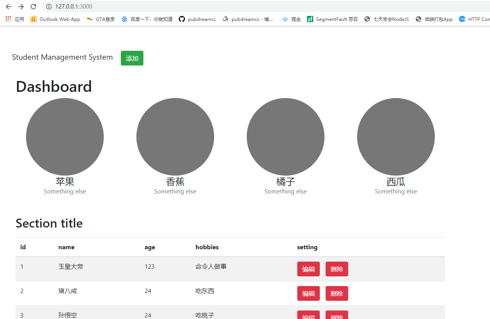
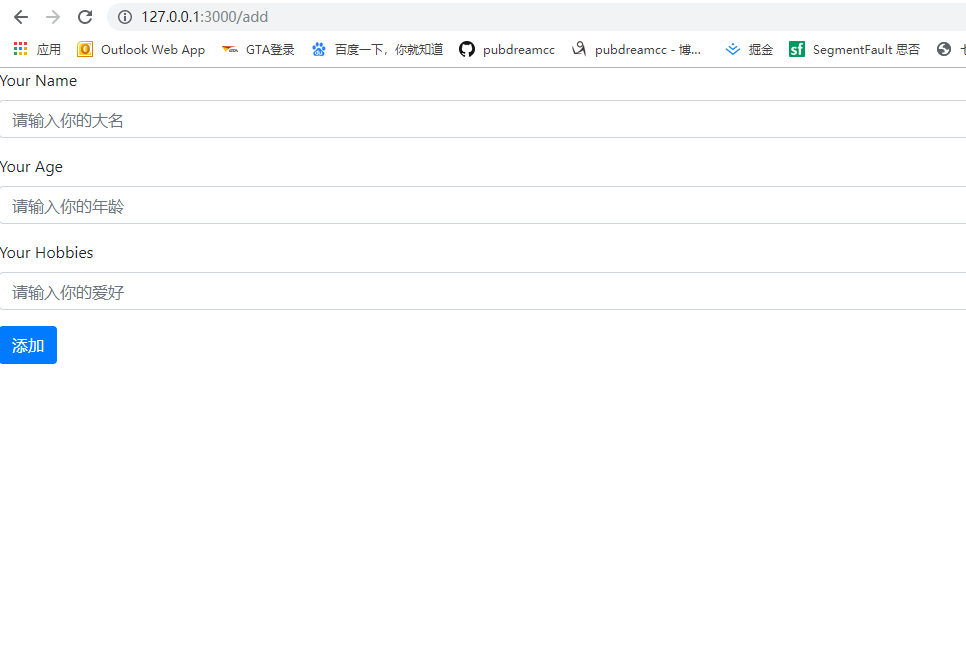
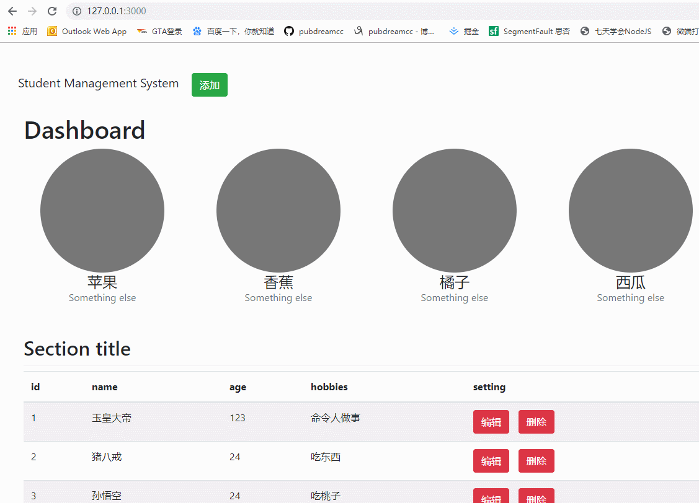

# Student-Management-System

基于Node.js的Express框架开发的学生信息管理系统，实现基本（C-R-U-D）功能，前端页面采用bootstrap快速搭建。

## 文件说明

* app.js -- 入口模块

* router.js -- 路由模块

* student.js -- 操作数据模块（封装操作数据的基本API）

* Db.json -- 模拟数据库，保存数据的文件

* `views`文件夹 -- 页面视图文件

* `public`文件夹 -- 静态资源文件

## 启动

1. `git clone` 克隆项目到本地

2. `npm install` 进入项目文件夹，下载相关依赖

3. `node app.js`  node启动项目

## 运行效果展示

* 首页展示学生信息列表，添加，删除，编辑导航

* 添加学生页，显示添加学生信息

* 动态演示，添加--编辑--删除

